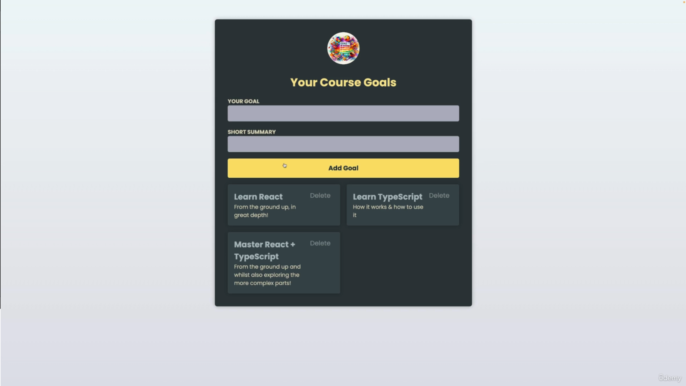

<h1 align="center">Course Goals</h1>
<div align="center">



<p align="center"><strong>Status do Projeto:<br></strong> <i>Em andamento</i> 🚧</p>

</div>
<p align="center">
<span><strong>Tecnologias e Ferramentas utilizadas:</strong></span>
<br>
  <a href="https://skillicons.dev">
    
  </a>
</p>

## Índice

- [1. Resumo do Projeto](#1-resumo-do-projeto)
- [2. Definição de Produto](#2-definição-de-produto)
- [3. Design](#3-design)
- [4. Instalação](#4-instalação)
- [5. Inicialização](#5-inicialização)
- [6. Tecnologias e Ferramentas Utilizadas](#6-tecnologias-e-ferramentas-utilizadas)
- [7. Desafios do Projeto](#7-desafios-do-projeto)
- [8. Desenvolvedor](#8-desenvolvedor)

## 1. Resumo do Projeto

Este projeto é um desafio do curso  [React & TypeScript - The Practical Guide](https://www.udemy.com/share/109JEF3@6xcu9Q4ep_QNZl21LCwPrm5RehSa2dAWoyTOMy20MCXy6d46hOsZTQbvHp2skMHn2A==/) que consiste numa aplicação React TS simplesque consome uma API que implementa as funcionalidades de um CRUD seguindo a lógica de metas de um curso.

## 2. Definição da aplicação

O Projeto Your Course Goals é uma aplicação com duas partes principais: **Card Principal** e **Metas**.

### Card Principal

O **Card Principal** é o componente principal da aplicação, ela está centralizada horizontalmente na página e dentro possui dois campos de texto, um botão cardzinhos menores que correspondem às **Metas** descritas nos campos.

## Metas

As **Metas** são acicionadas quando o botão no **Card Principal** é pressionado. Ele possuí um título, uma descrição da meta e a opção de deletar a meta

## 3. Design

O Design foi fornecido pela desafiador. Foram dadas fontes, cores e imagens de referência para o projeto.

### Desktop


## 4. Instalação

### Pré-requisitos:

- Node.js
- npm

Para instalar as dependências no diretório do seu projeto, execute o seguinte comando:

```
npm install
```

## 5. Inicialização

Para iniciar o aplicativo, execute o seguinte comando:

```
npm run dev
```

## 6. Tecnologias e Ferramentas Utilizadas

Este site foi construído com:

- JavaScript
- TypeScript
- React

## 7. Desafios do Projeto

- **Gerais:**

  - [✅] O site deve seguir o [design](#3-design) proposto;

  - [✅] A aplicação deve ter as funcionalidades de um CRUD;

  - [✅] Criar um readme do projeto;

  - [✅] capturar estado e exibir nos Cards de meta;

- **Cards Secundários:**

  - [✅] Ter tamanhos variados, de acordo com o tamanho do texto;

  - [✅] efeito ressaltado;


## 8. Desenvolvedor

Este projeto foi Proposto por: [Maximilian Schwarzmüller](https://github.com/maxschwarzmueller)

Desenvolvido por:

**João Zacarias** : [LinkedIn](https://br.linkedin.com/in/joão-zacarias-neto-593441237) | [GitHub](https://github.com/joao-zac)